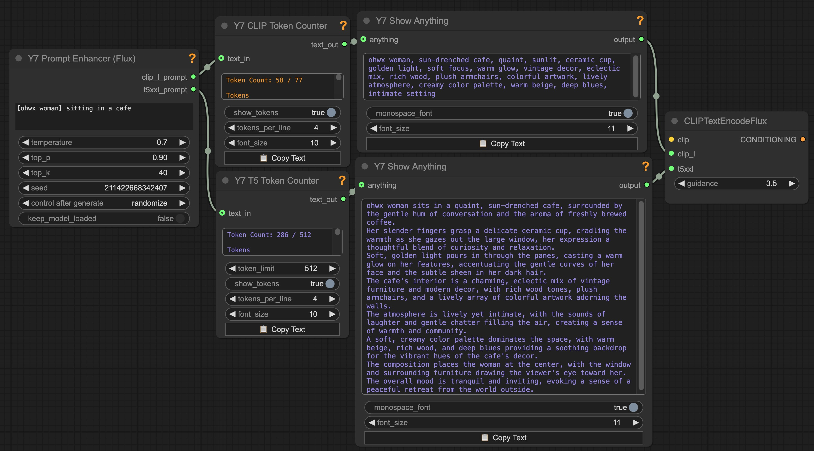

# ComfyUI-Y7Nodes

A collection of utility / quality-of-life nodes for ComfyUI - Probably only useful to me.  There's really nothing new here. Some nodes are modifications of of existing custom nodes with additional features that suit my particular needs.

## Installation (ComfyUI Manager)

 #### This is the better way to install: 
 - Open `ComfyUI Manager` 
   - → `Custom Nodes Manager` 
   - → Search for `Y7` or `Y7Nodes`. 
   - Install. 
   - Restart Restart ComfyUI

------

## Installation (Manual)

1. Clone this repository into your ComfyUI custom_nodes directory:
   ```bash
   cd /path/to/ComfyUI/custom_nodes
   git clone https://github.com/yushan777/ComfyUI-Y7Nodes
   
   ```

2. Install Dependencies
   ```bash
   # activate your venv (if you have one)
   # Linux/macOS
   source venv/bin/activate
   or 
   # Windows
   venv/Scripts/activate
   
   pip install -r requirements.txt   
   ```

3. Restart ComfyUI if it's already running.

------

## Nodes

### Y7 Show Anything

Based on other nodes that already work just fine.  I just always wanted one with a `copy text` button for easy copying of long generated prompts (for editing or use elsewhere). It will primarily show `string, integer, float and boolean` values directly but will also (try to) display tensor data. 


---

### Y7 CLIP Token Counter

Takes text (string) as input and, using the CLIP tokenizer, displays:
- The number of tokens in the text  
- Whether the input exceeds the model’s token limit  
- The final token within the range, along with surrounding context  
- All tokens within the limit, plus any overflow tokens beyond it
- Copy Text button : copies the contets displayed in the text widget
- Pass-though output for original text


------

### T5 Token Counter

Takes text (string) as input and, using the T5 XXl tokenizer, displays:

- The number of tokens in the text  

- Whether the input exceeds the model’s token limit  (256 or 512)

- The final token within the range, along with surrounding context  

- All tokens within the limit, plus any overflow tokens beyond it

- Copy Text button: copies the contets displayed in the text widget

- Pass-though output for original text


------
### Y7 Prompt Enhancer (Flux)



**Prompt Enhancer (Flux)** will take any basic prompt and enhance it and produce T5 and CLIP friendly variants of the enhanced prompt. If you have fine-tuned a model with a token / trigger word then use `[trigger_word]` or if it's combined with a subject `[trigger_word man]`.

LLM model used is: Meta's [Llama-3.2-3B-Instruct (from unsloth's repo)](https://huggingface.co/unsloth/Llama-3.2-3B-Instruct)

#### Background: 

Flux.1 uses two encoders: CLIP and T5 XXL. CLIP processes only the first 77 tokens (including <bos>/<eos>), and anything beyond that depends on the implementation. In ComfyUI, long prompts are split into 77-token chunks for CLIP, which are then batched and concatenated. On the other hand, T5, supports up to 512 tokens (or 256 in the “schnell” version) and works well with natural, descriptive language.

Most users simply feed the same (T5) prompt into both encoders, as it’s the most straightforward approach. However, because the first 77 tokens are shared by both encoders—and the rest are exclusive to T5—how you structure your prompt can make a big difference.

Front-loading long prose too early can reduce CLIP’s effectiveness, while cramming too many keywords up front may limit T5’s ability to build nuance throughout the rest of the prompt.

For better results (possibly), a hybrid approach of starting with high-impact keywords to guide CLIP, then follow with flowing, descriptive language tailored for T5. This approach plays to the strengths of both encoders (maybe).

The node will attempt to download the required model files (approx 6.5GB) if they don't exist.  If you wish to download them manually then you can get the files from https://huggingface.co/unsloth/Llama-3.2-3B-Instruct and place them under `ComfyUI/models/LLM/Llama-3.2-3B-Instruct`. The files you need are:

```
ComfyUI
└── models
    └── LLM
        └── Llama-3.2-3B-Instruct
            ├── config.json
            ├── generation_config.json
            ├── model.safetensors
            ├── model.safetensors.index.json
            ├── special_tokens_map.json
            ├── tokenizer.json
            └── tokenizer_config.json
```


------


### Y7 Grid 2 Batch

Takes a grid of images (like those generated in XY-plots) and processes it into a batch of individual images.  Define the number of rows, columns, the size of the individual images in the grid, any offsets (to account for headers). Output is a batch of images that can be processed further in your workflow


**Parameters:**

- `rows`: Number of rows in the grid
- `columns`: Number of columns in the grid
- `width`: Width of each individual image in the grid (in pixels)
- `height`: Height of each individual image in the grid (in pixels)
- `x_header`: If grid has an X header, specify its width in pixels. Set to 0 if there is no header.
- `y_header`: If grid has a Y header, specify its height in pixels. Set to 0 if there is no header.


---

## Example Workflows

Example workflows can be found in the `workflows` directory. 

## License

This project is licensed under the MIT License - see the [LICENSE](LICENSE) file for details.

## Credits

- ShowAnything node is based on "Show Any" from yolain's ComfyUI-Easy-Use custom nodes and "Show Any To JSON" from crystian's ComfyUI-Crystools custom nodes, with additional formatting controls and a Copy Text button.
- Help popup system is based on the implementation from Kosinkadink's ComfyUI-VideoHelperSuite.

