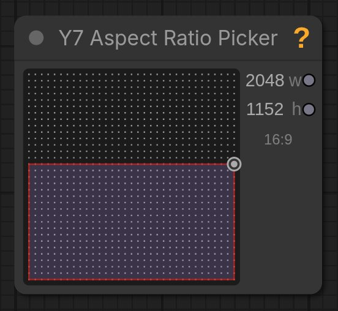
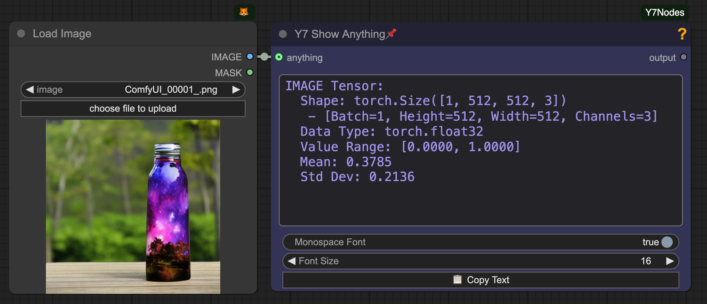
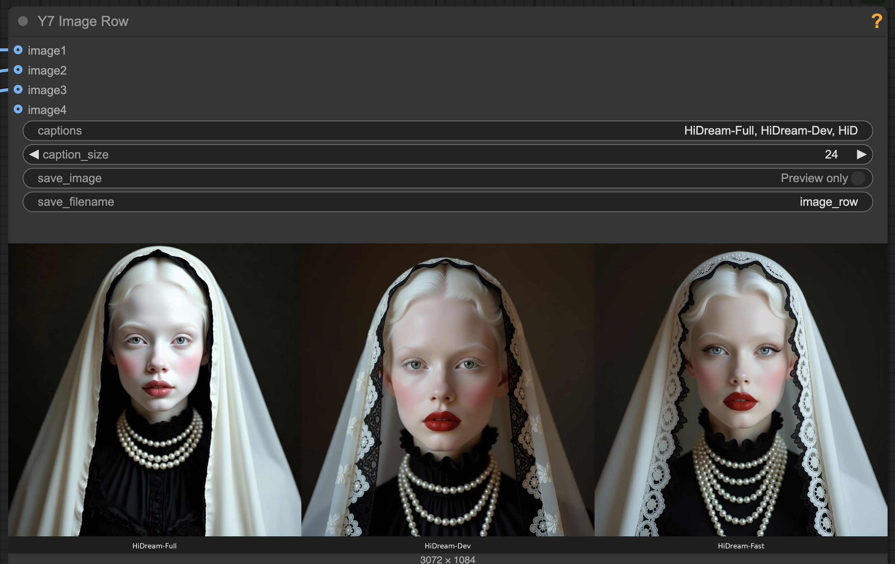
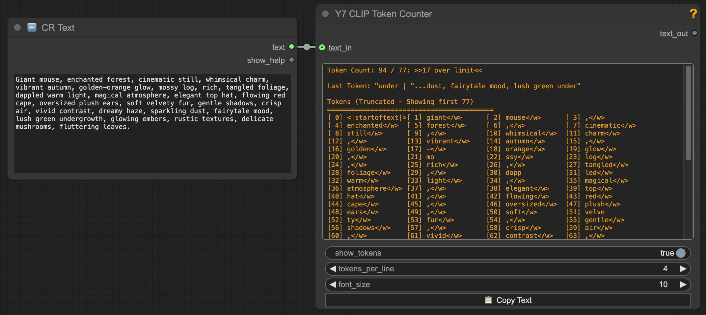
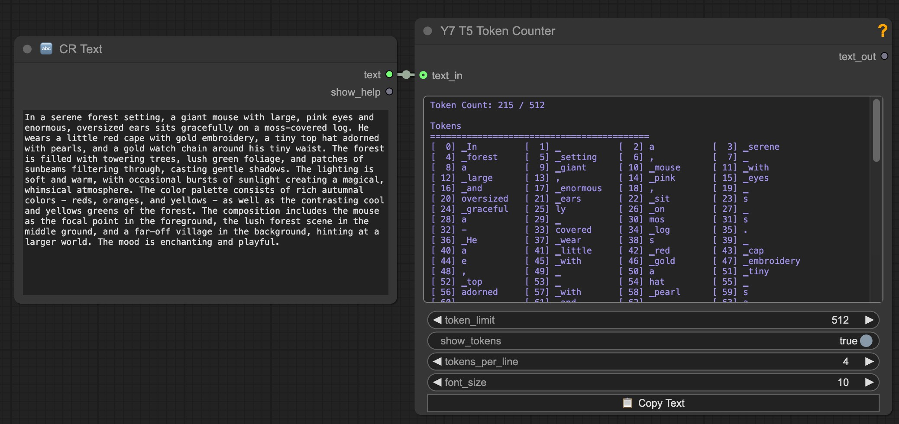
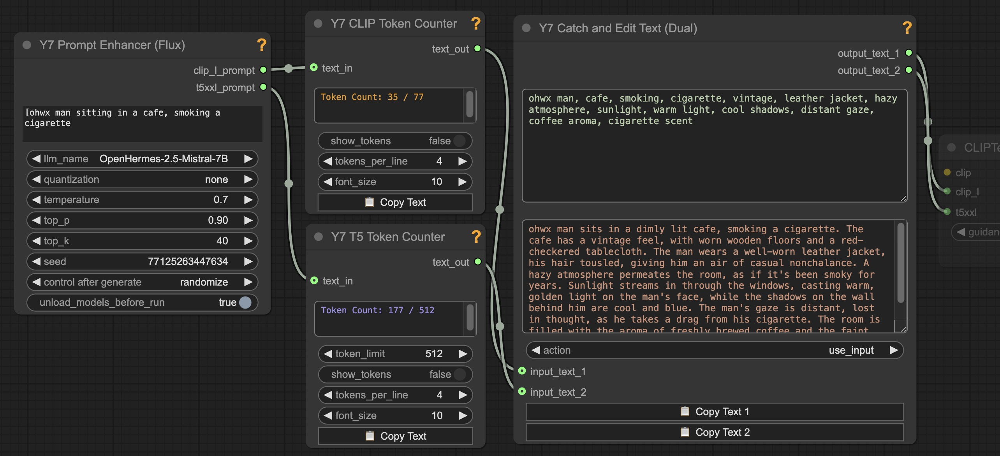
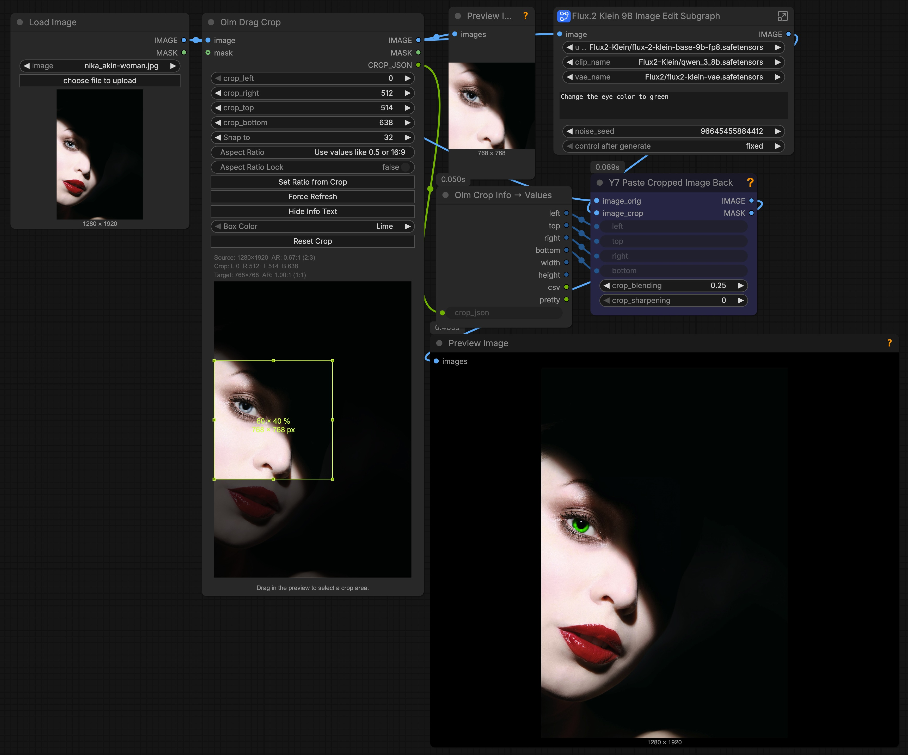

# ComfyUI-Y7Nodes

A collection of utility / quality-of-life nodes for ComfyUI - Probably only useful to me.  There's really nothing new here. Some nodes are modifications of of existing custom nodes with additional features that suit my particular needs.

## Installation (ComfyUI Manager)

 #### This is the better way to install: 
 - Open `ComfyUI Manager` 
   - → `Custom Nodes Manager` 
   - → Search for `Y7` or `Y7Nodes`. 
   - Install. 
   - Restart Restart ComfyUI

------

## Installation (Manual)

1. Clone this repository into your ComfyUI custom_nodes directory:
   ```bash
   cd /path/to/ComfyUI/custom_nodes
   git clone https://github.com/yushan777/ComfyUI-Y7Nodes
   
   ```

2. Install Dependencies
   ```bash
   # activate your venv (if you have one)
   # Linux/macOS
   source venv/bin/activate
   or 
   # Windows
   venv/Scripts/activate
   
   pip install -r requirements.txt   
   ```

3. Restart ComfyUI if it's already running.

------

## Nodes

### Y7 Aspect Ratio Picker

> Interactive 2D canvas for picking image width and height by dragging.
>
> 
> <details>
>   <summary>ℹ️ <i>See More Information</i></summary>
>
>   - Click or drag anywhere in the canvas to set width (X axis, left→right) and height (Y axis, bottom→top).
>   - A filled rectangle shows the selected proportions; the dot marks the current position.
>   - The simplified aspect ratio (e.g. 16:9, 4:3, 1:1) is displayed at the bottom of the canvas.
>   - Current width and height values are shown in the right panel. Double-click either value to type a number directly.
>   - Click the **Swap** button (below the height value) to swap width and height (portrait ↔ landscape).
>   - Snapping to step increments is on by default. Hold Shift while dragging to temporarily disable snapping.
>   - Node properties (right-click → Properties): `valueX`, `valueY`, `minX`, `maxX`, `minY`, `maxY`, `stepX`, `stepY`, `snap`, `dots`.
>   - The right panel shows width, height, simplified ratio (e.g. 16:9), and total megapixels (e.g. 1.0MP).
>   - Outputs `width` and `height` as INT.
>
> </details>

---

### Show Anything

> Takes input from any (most?) nodes and displays it in a readable format and provides a Copy Text button for easily copying the displayed content.
>
> 
> <details>
>   <summary>ℹ️ <i>See More Information</i></summary>
>   
>   - Based on other nodes that already work just fine. I just always wanted one with a `copy text` button for easy copying of long generated prompts (for editing or use elsewhere). It will primarily show `string, integer, float and boolean` values directly but will also (try to) display tensor data.
>
> </details>

---
### Image Row
> Takes up to 4 images and concats them together horizontally in a row with captions:
> 
> 
> <details>
>   <summary>ℹ️ <i>See More Information</i></summary>
>
>   - Captions list will map too whatever images has been inputed
>   - Preview mode by default, switch to save mode.
> </details>

---

### CLIP Token Counter

> Takes text (string) as input and, using the CLIP tokenizer, displays token count and more:
> 
> 
> <details>
>   <summary>ℹ️ <i>See More Information</i></summary>
>   
>   - Displays the number of tokens in the text  
>   - Whether the input exceeds the model's token limit  (77 - Including BOS and EOS)
>   - The final token within the range, along with surrounding context  
>   - All tokens within the limit, plus any overflow tokens beyond it
>   - Copy Text button: copies the contents displayed in the text widget
>   - Pass-though output for original text
>
> </details>

---

### T5 Token Counter

> Takes text (string) as input and, using the T5 XXL tokenizer, displays token count and more:
> 
> 
> <details>
>   <summary>ℹ️ <i>See More Information</i></summary>
>   
>   - Displays the number of tokens in the text  
>   - Whether the input exceeds the model's token limit  (256 or 512 - Including EOS)
>   - The final token within the range, along with surrounding context  
>   - All tokens within the limit, plus any overflow tokens beyond it
>   - Copy Text button: copies the contents displayed in the text widget
>   - Pass-though output for original text
>
> </details>

------

### Catch and Edit Text (Dual)
> Based on the original 
> A node that catches and shows text(s) generated from a previous node and enables editing the text for subsequent runs. Using the edited text also mutes the input node.  Modified from the original to take two text inputs to work with the Prompt Enhancer (shown below) and provide two text outputs.
> 
> 
> <details>
>   <summary>ℹ️ <i>See More Information</i></summary>
>
>   See screenshot for Prompt Enhancer below. 
>
>   This node acts as a receiver and editor for text sent from two sources.
action widget:
- use_input: pass the input text as it without modification.
- use_edit_mute_input: pass the edited texts in the widgets and mute the source node of the input(s).

If you just need one text input then I recommend using [ImagineerNL's original node](https://github.com/ImagineerNL/ComfyUI-IMGNR-Utils).
> </details>

------

### Y7 Prompt Enhancer (Flux.1)

> Takes any basic prompt and enhances it and produces T5 and CLIP friendly variants of the enhanced prompt. token / trigger words can be used in sq. brackets
> Example: [ohwx man], [agg woman], [sks dog]
>
> 
> <details>
>   <summary>ℹ️ <i>See More Information</i></summary>
>   
>   
>   
>   Flux.1 uses two encoders: CLIP and T5 XXL. CLIP processes only the first 77 tokens (including <bos>/<eos>), and anything beyond that depends on the implementation. In ComfyUI, long prompts are split into 77-token chunks for CLIP, which are then batched and concatenated. On the other hand, T5, supports up to 512 tokens (or 256 in the "schnell" version) and works well with natural, descriptive language.
>   
>   Most users simply feed the same (T5) prompt into both encoders, as it's the most straightforward approach. However, because the first 77 tokens are shared by both encoders—and the rest are exclusive to T5—how you structure your prompt can make a big difference.
>   
>   Front-loading long prose too early can reduce CLIP's effectiveness, while cramming too many keywords up front may limit T5's ability to build nuance throughout the rest of the prompt.
>   
>   For (possibly) better results, a hybrid approach of starting with high-impact keywords to guide CLIP, then follow with flowing, descriptive language tailored for T5. This approach plays to the strengths of both encoders (again, possibly).
>   
>   **Token/Trigger words** are handled by enclosing them inside square brackets `[ohwx man]`, but occasionally it might not work.
>
>  There can be quirks in some of the responses generated, but it will get you most of the way in producing prompts in both formats very quickly and you can always edit them afterwards (in your own editor). 
>   
>   Four LLM models are available, offering a balance of knowledge, instruction-following, and minimal censorship.
> 
>   If you're using a GPU with limited VRAM, consider switching to 8-bit or 4-bit quantization to reduce memory usage (with some trade-offs in quality).
**Note: This requires BitsandBytes** which is primarily Linux-focused. Support for Windows and macOS can be tricky — and there might be workarounds, but they’re beyond the scope of this note.
If you're running ComfyUI inside WSL (Windows Subsystem for Linux), you should be fine
>
>   Additionally, you can choose to unload all models before each run — helpful for workflows involving other large models that remain cached. Alternatively, you can always use [SeanScripts's Unload Model custom nodes](https://github.com/SeanScripts/ComfyUI-Unload-Model) which provide a convenient way to handle this dynamically.
>
>   The node will attempt to download the selected model (approx 14.5GB) if it can't be found.  
>
>   If you wish to download the model(s) manually, links and paths shown below:
>   https://huggingface.co/teknium/OpenHermes-2.5-Mistral-7B 
>   
>   ```
>   ComfyUI
>   └── models
>       └── LLM
>           └── OpenHermes-2.5-Mistral-7B
>           |   ├── added_tokens.json
>           |   ├── config.json
>           |   ├── generation_config.json
>           |   ├── model-00001-of-00002.safetensors
>           |   ├── model-00002-of-00002.safetensors
>           |   ├── model.safetensors.index.json
>           |   ├── special_tokens_map.json
>           |   ├── tokenizer.model
>           |   ├── tokenizer_config.json
>           |   ├── transformers_inference.py>           
>   ```
>   
>   For https://huggingface.co/teknium/Hermes-Trismegistus-Mistral-7B (approx. 14.5GB)
>   
>   ```
>   ComfyUI
>   └── models
>       └── LLM        
>           └── Hermes-Trismegistus-Mistral-7B        
>           |   ├── added_tokens.json
>           |   ├── config.json
>           |   ├── generation_config.json
>           |   ├── pytorch_model-00001-of-00002.bin
>           |   ├── pytorch_model-00002-of-00002.bin
>           |   ├── pytorch_model.bin.index.json
>           |   ├── special_tokens_map.json
>           |   ├── tokenizer.model
>           |   ├── tokenizer_config.json
>   ```
>
>   For https://huggingface.co/cognitivecomputations/Dolphin3.0-Llama3.1-8B (approx. 16GB)
>   ```
>   ComfyUI
>   └── models
>       └── LLM        
>           └── Dolphin3.0-Llama3.1-8B        
>           |   ├── config.json
>           |   ├── generation_config.json
>           |   ├── model-00001-of-00004.safetensors
>           |   ├── model-00002-of-00004.safetensors
>           |   ├── model-00003-of-00004.safetensors
>           |   ├── model-00004-of-00004.safetensors
>           |   ├── model.safetensors.index.json
>           |   ├── special_tokens_map.json
>           |   ├── tokenizer_config.json
>           |   ├── tokenizer.json
>           |   ├── trainer_state.json
>   ```

>   For https://huggingface.co/Qwen/Qwen2.5-7B-Instruct (approx. 15.2GB)
>   ```
>   ComfyUI
>   └── models
>       └── LLM        
>           └── Qwen2.5-7B-Instruct      
>           |   ├── config.json
>           |   ├── generation_config.json
>           |   ├── merges.txt
>           |   ├── model-00001-of-00004.safetensors
>           |   ├── model-00002-of-00004.safetensors
>           |   ├── model-00003-of-00004.safetensors
>           |   ├── model-00004-of-00004.safetensors
>           |   ├── model.safetensors.index.json
>           |   ├── tokenizer.json
>           |   ├── tokenizer_config (1).json
>           |   ├── tokenizer_config.json
>           |   ├── vocab.json
>   ```


> </details>

------

### Y7 Prompt Enhancer (Flux.2 Klein)

> Takes any basic prompt and enhances it specifically for FLUX.2 [klein] using the Qwen3-8B LLM model or an abliterated version. Features include customizable prompt instructions, thinking mode, and advanced generation parameters.
>
> <details>
>   <summary>ℹ️ <i>See More Information</i></summary>
>   
>   This node is designed specifically for FLUX.2 [klein] image generation and uses the Qwen3-8B model to transform basic prompts into detailed, high-quality prompts.
>   
>   **Key Features:**
>   
>   - **Qwen3-8B Model**: Uses advanced LLM for prompt enhancement
>   - **Josiefied-Qwen3-8B-abliterated Model**: Abliterated variant of the Qwen3-8B Model
>   - **Thinking Mode**: Enable/disable the model's reasoning process output
>   - **Quantization Support**: Choose between none, 8-bit, or 4-bit quantization (requires bitsandbytes - primarily Linux)
>   - **Platform Support**: Works on CUDA, Apple Silicon (MPS), and CPU
>   - **Advanced Parameters**: Control temperature, top_p, top_k, and max_new_tokens for fine-tuned generation
>   - **Memory Management**: Option to keep model loaded for faster batch processing
>   - **Numerical Stability**: Built-in handling for numerical edge cases during generation
>   
>   **Outputs:**
>   - `thinking_output`: The model's reasoning process (when thinking mode is enabled)
>   - `enhanced_prompt`: The final enhanced prompt for FLUX.2 [klein]
>   
>   **Customizing Prompt Instructions:**
>   
>   To customize how the model enhances prompts:
>   1. Copy `system_messages_example.py`
>   2. Rename it to `system_messages.py`
>   3. Edit the file with your custom instructions
>   4. The node will automatically load your custom version
>   
>   **Model Information:**
>   
>   The HuggingFace transformers version of Qwen3-8B is Required and cannot use the Comfy-Org packaged version.
>   This node performs runtime text generation for prompt enhancement and reasoning using AutoModelForCausalLM and AutoTokenizer. These capabilities—tokenizer access, generation control, and model.generate()—are only available through the HuggingFace transformers API.
>   Comfy-Org’s Qwen models are optimized for inference-only graph execution inside ComfyUI and do not expose the full language-model interfaces required for programmatic text generation outside the standard sampling flow.
>   If Qwen3-8B is not found locally, the node will automatically download it (~16GB) from HuggingFace to models/LLM/Qwen3-8B.

>   
>   Manual download location (if needed):
>   https://huggingface.co/Qwen/Qwen3-8B  
>   https://huggingface.co/Goekdeniz-Guelmez/Josiefied-Qwen3-8B-abliterated-v1
>   
>   ```
>   ComfyUI
>   └── models
>       └── LLM
>           └── Qwen3-8B
>               ├── config.json
>               ├── generation_config.json
>               ├── merges.txt
>               ├── model.safetensors.index.json
>               ├── model-00001-of-00004.safetensors
>               ├── model-00002-of-00004.safetensors
>               ├── model-00003-of-00004.safetensors
>               ├── model-00004-of-00004.safetensors
>               ├── tokenizer.json
>               ├── tokenizer_config.json
>               └── vocab.json
>
>           └── Josiefied-Qwen3-8B-abliterated-v1
>               ├── added_tokens.json
>               ├── config.json
>               ├── generation_config.json
>               ├── merges.txt
>               ├── model-00001-of-00004.safetensors
>               ├── model-00002-of-00004.safetensors
>               ├── model-00003-of-00004.safetensors
>               ├── model-00004-of-00004.safetensors
>               ├── model.safetensors.index.json
>               ├── special_tokens_map.json
>               ├── tokenizer_config.json
>               ├── tokenizer.json
>               └── vocab.json
>   ```
>   
>   **Performance Tips:**
>   
>   - Use quantization (8-bit or 4-bit) if you have limited VRAM
>   - Enable "keep_model_loaded" when processing multiple prompts in succession
>   - Lower temperature values (0.4-0.7) produce more consistent results
>   - Adjust max_new_tokens based on desired prompt length
>
> </details>

------

### LM Studio Nodes — Prerequisites

> The **LM Studio (Text)**, **LM Studio (Vision)**, and **Select LMS Model** nodes all require a running [LM Studio](https://lmstudio.ai/) server. LM Studio is a free desktop application for running LLMs locally.
>
> <details>
>   <summary>ℹ️ <i>LM Studio Server Setup</i></summary>
>   
>   **Local Setup (same machine as ComfyUI):**
>   
>   1. Download and install [LM Studio](https://lmstudio.ai/)
>   2. Download a model through the LM Studio interface (for vision nodes, ensure you pick a VL model, e.g. Qwen2.5-VL, Gemma3, etc.)
>   3. Load the model in LM Studio
>   4. Start the local server: go to the **Developer** tab (or **Local Server** in older versions) and click **Start Server**
>   5. By default, the server runs on `localhost:1234` — this matches the default `ip` and `port` values in the nodes
>   
>   **Network Setup (LM Studio on a different machine):**
>   
>   If LM Studio is running on another machine on your network:
>   
>   1. In LM Studio's server settings, enable **Serve on Local Network** (this binds the server to `0.0.0.0` instead of `127.0.0.1`)
>   2. Note the IP address of the machine running LM Studio (e.g., `192.168.1.100`)
>   3. In the ComfyUI node, set the `ip` field to that machine's IP address and ensure the `port` matches (default: `1234`)
>   4. Make sure there are no firewall rules blocking the port between the two machines
>   
>   **Model Identifier:**
>   
>   The `model_identifier` should match the model name as it appears in LM Studio. You can use the **Select LMS Model** node to pick from a predefined list stored in `comfyui-y7nodes/lms_config/models.txt` (one model name per line).
>   
>   **Python Package:**
>   
>   These nodes require the `lmstudio` Python SDK: `pip install lmstudio`
>
> </details>

---

### Y7 LM Studio (Text)

> Send text prompts to a local LM Studio server for text generation and prompt enhancement using any LLM loaded in LM Studio. Supports speculative decoding via a draft model.
>
> <details>
>   <summary>ℹ️ <i>See More Information</i></summary>
>   
>   Connects to an LM Studio server and sends a text prompt along with a system message to guide the model's behavior. The default system message is optimized for AI image prompt enhancement, but can be customized for any text generation task.
>   
>   **Key Features:**
>   
>   - **System Message**: Customizable system prompt that guides the LLM's behavior (default: image prompt enhancement)
>   - **Draft Model**: Optional speculative decoding support for faster generation
>   - **Reasoning Extraction**: Automatically separates thinking/reasoning blocks from the response
>   - **Memory Management**: Options to unload the LLM after generation and/or free ComfyUI VRAM beforehand
>   - **Fallback Handling**: Automatically retries with an alternative chat template if the first attempt fails
>   
>   **Inputs:**
>   
>   - `prompt`: The text prompt to send to the LLM (connected from another node)
>   - `model_identifier`: The model name/identifier loaded in LM Studio (connect a Select LMS Model node or type manually)
>   - `draft_model`: Optional speculative decoding draft model name (leave empty to disable)
>   - `system_message`: System prompt that guides the LLM's behavior
>   - `reasoning_tag`: Tag name used to extract reasoning blocks (e.g., `think` for `<think>...</think>`)
>   - `ip` / `port`: LM Studio server address (default: localhost:1234)
>   - `temperature`: Controls randomness (0.01–1.0, default 0.7)
>   - `max_tokens`: Maximum tokens to generate (-1 for unlimited)
>   - `unload_llm`: Unload the LLM from LM Studio after generation
>   - `unload_comfy_models`: Free VRAM by unloading ComfyUI models before running the LLM
>   
>   **Outputs:**
>   
>   - `Extended Prompt`: The generated text with reasoning blocks removed
>   - `Reasoning`: The extracted reasoning content (if present)
>   
>   **Requirements:**
>   
>   - LM Studio running locally (or on a network-accessible machine)
>
> </details>

---

### Y7 LM Studio (Vision)

> Send an image to a vision-capable LLM (VL model) in LM Studio for analysis and description. The instruction is provided via the system message — no separate text prompt input.
>
> <details>
>   <summary>ℹ️ <i>See More Information</i></summary>
>   
>   Connects to an LM Studio server and sends an image along with an instruction to a vision-language (VL) model. The system message acts as the sole instruction for how the model should interpret the image. The model must be vision-enabled or an error will be raised.
>   
>   **Key Features:**
>   
>   - **Vision-First Design**: Image is a required input — purpose-built for VL models
>   - **Instruction via System Message**: The system message is sent alongside the image as the user instruction (default: detailed image description)
>   - **Model Validation**: Checks that the loaded model supports vision before proceeding
>   - **Reasoning Extraction**: Automatically separates thinking/reasoning blocks from the response
>   - **Memory Management**: Options to unload the LLM after generation and/or free ComfyUI VRAM beforehand
>   
>   **Inputs:**
>   
>   - `image`: The image to analyze (required)
>   - `model_identifier`: The VL model name/identifier loaded in LM Studio (connect a Select LMS Model node or type manually)
>   - `system_message`: The instruction sent alongside the image (default: describe the image in detail)
>   - `reasoning_tag`: Tag name used to extract reasoning blocks (e.g., `think` for `<think>...</think>`)
>   - `ip` / `port`: LM Studio server address (default: localhost:1234)
>   - `temperature`: Controls randomness (0.01–1.0, default 0.7)
>   - `max_tokens`: Maximum tokens to generate (-1 for unlimited)
>   - `unload_llm`: Unload the LLM from LM Studio after generation
>   - `unload_comfy_models`: Free VRAM by unloading ComfyUI models before running the LLM
>   
>   **Outputs:**
>   
>   - `Response`: The model's analysis/description with reasoning blocks removed
>   - `Reasoning`: The extracted reasoning content (if present)
>   
>   **Requirements:**
>   
>   - LM Studio running locally (or on a network-accessible machine)
>   - A vision-capable model loaded in LM Studio (non-vision models will raise an error)`
>
> </details>

---

### Y7 Select LMS Model

> Select an LM Studio model from a predefined list stored in a text file. Outputs the model identifier string to connect to the LM Studio Text or Vision nodes.
>
> <details>
>   <summary>ℹ️ <i>See More Information</i></summary>
>   
>   Provides a dropdown of model identifiers loaded from `comfyui-y7nodes/lms_config/models.txt`. Add your favorite model names (one per line) to this file.
>   
>   **Output:**
>   
>   - `model_id`: The selected model identifier string
>
> </details>

---

### Y7 Qwen3-VL

> Run vision-language inference using Qwen3-VL models directly within ComfyUI. Supports image analysis and text-only queries with multiple preset instructions and customizable prompts.
>
> <details>
>   <summary>ℹ️ <i>See More Information</i></summary>
>
>   Uses the HuggingFace `Qwen3VLForConditionalGeneration` model integrated with ComfyUI's memory manager for proper VRAM coordination alongside other loaded models (diffusion models, VAE, etc.).
>
>   **Models Available:**
>
>   - `Qwen/Qwen3-VL-2B-Instruct`
>   - `Qwen/Qwen3-VL-4B-Instruct`
>   - `Qwen/Qwen3-VL-8B-Instruct` (default)
>   - `Qwen/Qwen3-VL-32B-Instruct`
>
>   **Preset Instructions:**
>
>   - **Tags**: Generates a comma-separated list of up to 50 visual tags for text-to-image AI
>   - **Simple Description**: A single concise sentence describing the main subject and setting
>   - **Detailed Description**: A detailed paragraph covering subject, environment, lighting, and composition
>   - **Ultra Detailed Description**: An extended paragraph with micro-details, textures, and lighting analysis
>   - **Cinematic Description**: A film-still style paragraph with camera language and mood
>   - **Detailed Analysis**: Structured output in sections: Subject, People, Environment, Lighting, Camera/Composition, Color/Texture
>   - **Short Story**: A short imaginative story inspired by the image
>   - **Prompt Refine & Expand**: Refines and expands a text prompt for creative image generation
>
>   **Inputs:**
>
>   - `image`: Optional image input — omit for text-only queries
>   - `model_name`: Which Qwen3-VL model to use
>   - `preset_prompt`: Built-in instruction for how the model should analyse the image
>   - `custom_prompt`: If filled, replaces the preset instruction entirely
>   - `max_new_tokens`: Maximum tokens to generate (64–4096, default 512)
>   - `temperature`: Controls randomness (0.0–2.0, default 0.7)
>   - `top_p`: Nucleus sampling threshold (0.0–1.0, default 0.9)
>   - `repetition_penalty`: Penalises repeated tokens (1.0–2.0, default 1.1)
>   - `seed`: Random seed for reproducibility
>   - `keep_model_loaded`: Keep the model in VRAM between runs to skip reloading
>   - `download_model`: Automatically download the selected model from HuggingFace if not found locally
>
>   **Output:**
>
>   - `response`: The model's text response
>
>   **Model Location:**
>
>   Models are stored in `models/LLM/<model-name>`. If `download_model` is enabled and the model is not found locally, it will be downloaded automatically from HuggingFace.
>
>   ```
>   ComfyUI
>   └── models
>       └── LLM
>           └── Qwen3-VL-8B-Instruct
>               ├── config.json
>               ├── generation_config.json
>               ├── model-*.safetensors
>               ├── preprocessor_config.json
>               ├── tokenizer.json
>               └── tokenizer_config.json
>   ```
>
> </details>

---

### Y7 JoyCaption

> Generate image captions using a JoyCaption LLaVA model, with full control over caption style, length, and generation parameters.
>
> <details>
>   <summary>ℹ️ <i>See More Information</i></summary>
>
>   A variant of [1038lab/ComfyUI-JoyCaption](https://github.com/1038lab/ComfyUI-JoyCaption). Only HuggingFace JoyCaption models are supported.
>
>   **Models** (downloaded automatically to `models/LLM/` on first use):
>
>   - `joycaption-beta-one-fp8` — FP8 Dynamic quantization variant
>   - `joycaption-beta-one` — Latest beta release (default)
>   - `joycaption-alpha-two` — Previous alpha release
>
>   **Caption Styles** (`prompt_style`):
>
>   - `Descriptive`, `Descriptive (Casual)`, `SDXL`, `Flux.2`, `MidJourney`, `Danbooru tag list`, `Art Critic`, `Product Listing`, `Social Media Post`
>
>   **Inputs:**
>
>   - `image`: The image to caption
>   - `model`: Which JoyCaption model to use
>   - `quantization`: Memory precision — `Full Precision (bf16)`, `Balanced (8-bit)`, or `Maximum Savings (4-bit)`
>   - `prompt_style`: Caption style (see above)
>   - `caption_length`: Target length — `any`, `very short`, `short`, `medium`, `long`, `very long`
>   - `max_new_tokens`: Maximum tokens to generate (1–2048, default 512)
>   - `temperature`: Controls randomness (0.0–2.0, default 0.6)
>   - `top_p`: Nucleus sampling threshold (0.0–1.0, default 0.9)
>   - `top_k`: Top-k sampling limit (0 = disabled, range 0–100)
>   - `seed`: Random seed for reproducible results
>   - `custom_prompt`: If filled, replaces the built-in prompt entirely
>   - `memory_management`: How to handle the model between runs:
>     - `Keep in Memory` — stays loaded (fastest for repeated runs)
>     - `Clear After Run` — frees VRAM immediately after each run
>     - `Global Cache` — shared cache across multiple JoyCaption node instances
>   - `extra_options` *(optional)*: Connect a **JoyCaption Extra Options** node to add caption modifiers
>
>   **Outputs:**
>
>   - `PROMPT`: The prompt sent to the model (useful for debugging)
>   - `STRING`: The generated caption text
>
> </details>

---

### Y7 JoyCaption Extra Options

> Optional caption modifiers — connect to the JoyCaption node to refine what the model includes or excludes in its output.
>
> <details>
>   <summary>ℹ️ <i>See More Information</i></summary>
>
>   Each toggle appends an instruction to the caption prompt. Enable only the options relevant to your use case.
>
>   | Option | Effect |
>   |---|---|
>   | Exclude People Info | Omit fixed attributes (ethnicity, gender) but keep changeable ones (hair, clothing) |
>   | Include Lighting | Describe lighting conditions |
>   | Include Camera Angle | Describe camera angle |
>   | Include Watermark | Note whether a watermark is present |
>   | Include JPEG Artifacts | Note whether JPEG artifacts are present |
>   | Include EXIF | Describe likely camera settings (aperture, shutter speed, ISO, etc.) |
>   | Exclude Sexual | Keep the caption PG |
>   | Exclude Image Resolution | Do not mention image resolution |
>   | Include Aesthetic Quality | Rate the subjective aesthetic quality (low to very high) |
>   | Include Composition Style | Describe composition style (leading lines, rule of thirds, etc.) |
>   | Exclude Text | Do not mention any text visible in the image |
>   | Specify Depth Field | Describe depth of field and background focus |
>   | Specify Lighting Sources | Mention likely artificial or natural light sources |
>   | Do Not Use Ambiguous Language | Avoid vague phrasing |
>   | Include NSFW | State whether the image is SFW, suggestive, or NSFW |
>   | Only Describe Most Important Elements | Focus only on the most prominent elements |
>   | Do Not Include Artist Name or Title | Omit artist name and artwork title |
>   | Identify Image Orientation | Note portrait, landscape, or square orientation |
>   | Include Character Age | Describe the ages of people/characters |
>   | Include Camera Shot Type | Specify shot type (close-up, medium shot, wide shot, etc.) |
>   | Exclude Mood Feeling | Do not describe mood or emotional tone |
>   | Include Camera Vantage Height | Specify vantage height (eye-level, bird's-eye, worm's-eye, etc.) |
>   | Mention Watermark | Explicitly mention any watermark present |
>   | Avoid Meta Descriptive Phrases | Skip phrases like "This image shows…" for cleaner T2I prompts |
>   | Refer Character Name | Refer to people/characters by the name in `character_name` |
>
>   The `character_name` field is used when **Refer Character Name** is enabled.
>
> </details>

---

### Y7 Image Batch Path

> Load a batch of images from a directory and output them as a list of image tensors with matching file paths. Designed to pair with Caption Saver and JoyCaption for batch captioning workflows.
>
> <details>
>   <summary>ℹ️ <i>See More Information</i></summary>
>
>   Supports jpg, jpeg, png, and webp. Images are EXIF-transposed and converted to RGB float32 tensors.
>
>   Connect `IMAGE` to JoyCaption (or any other VLM node) and `IMAGE_PATH` to Caption Saver. The path list tells Caption Saver exactly where to write each `.txt` file.
>
>   **Inputs:**
>
>   - `image_dir`: Path to the directory containing images
>   - `batch_size`: Number of images to load (0 = all)
>   - `start_from`: 1-based index of the first image to load — useful for resuming part-way through a directory
>   - `sort_method`: Load order — `sequential` (alphabetical), `reverse`, or `random`
>
>   **Outputs** (both are lists):
>
>   - `IMAGE`: List of image tensors, one per file
>   - `IMAGE_PATH`: List of full file paths matching each image tensor
>
>   Note: When `sort_method` is `random`, the node re-evaluates on every run.
>
> </details>

---

### Y7 Caption Saver

> Save a caption string as a `.txt` file next to the source image, using the same filename stem (e.g. `cat.jpg` → `cat.txt`).
>
> <details>
>   <summary>ℹ️ <i>See More Information</i></summary>
>
>   Designed to pair with **Image Batch Path** and **JoyCaption**: connect `IMAGE_PATH` from Image Batch Path and the caption `STRING` from JoyCaption.
>
>   Compatible with any node that outputs a STRING — not limited to JoyCaption. Examples: Florence2, MiniCPM, LLaVA, Qwen-VL, etc.
>
>   **Inputs:**
>
>   - `string`: The caption text to write (must be connected)
>   - `image_path`: Full path to the source image (must be connected — e.g. from Image Batch Path)
>   - `overwrite`: If true, overwrites any existing `.txt` file. If false, appends a counter to avoid overwriting (e.g. `cat_01.txt`, `cat_02.txt`)
>
>   This node has no outputs — it is a terminal/output node.
>
> </details>

---

### Y7 Image Size Presets
> Select predefined image size/aspect ratios from a named preset set. Provides width and height outputs.
>
> <details>
>   <summary>ℹ️ <i>See More Information</i></summary>
>
>   - Provides outputs for `width` and `height` (INT).
>   - The `preset` widget selects the active dimension set: `default`, `flux.2`, `qwen-image`, or `custom*`.
>   - The `dimension` dropdown updates dynamically to show only the dimensions for the selected preset.
>   - Select `Custom` from the dimension dropdown to use manually entered `custom_w` / `custom_h` values.
>   - The `custom*` preset loads from `custom_dimensions.json` in the `nodes` directory; falls back to `default` if the file is missing or invalid. See `custom_dimensions_example.json` for the expected format.
> </details>

---

### Y7 Scale Image By

> Scales an image by a multiplier while preserving aspect ratio.
>
> <details>
>   <summary>ℹ️ <i>See More Information</i></summary>
>
>   Multiplies both width and height by `scale_by`, then resamples using the chosen method. The output resolution is displayed directly on the node after execution.
>
>   **Inputs:**
>
>   - `image`: The input image to scale
>   - `upscale_method`: Resampling algorithm — `nearest-exact`, `bilinear`, `area`, `bicubic`, or `lanczos`
>   - `scale_by`: Multiplier applied to both dimensions (default: 1.0, range: 0.01–8.0)
>   - `resolution_steps`: Snap output dimensions to the nearest multiple of this value (default: 8). Common values: 8, 16, 64
>
>   **Outputs:**
>
>   - `image`: The scaled image
>   - `width`: Output width in pixels (INT)
>   - `height`: Output height in pixels (INT)
>
> </details>

---

### Y7 Scale Image to Total Pixels

> Scales an image to a target total pixel count (in megapixels) while preserving aspect ratio.
>
> <details>
>   <summary>ℹ️ <i>See More Information</i></summary>
>
>   Computes a uniform scale factor so that `width × height` equals the target megapixel count, then resamples using the chosen method. The output resolution is displayed directly on the node after execution.
>
>   **Inputs:**
>
>   - `image`: The input image to scale
>   - `upscale_method`: Resampling algorithm — `nearest-exact`, `bilinear`, `area`, `bicubic`, or `lanczos`
>   - `megapixels`: Target total pixel count in megapixels (default: 1.0, range: 0.01–16.0)
>   - `resolution_steps`: Snap output dimensions to the nearest multiple of this value (default: 8). Common values: 8, 16, 64
>
>   **Outputs:**
>
>   - `image`: The scaled image
>   - `width`: Output width in pixels (INT)
>   - `height`: Output height in pixels (INT)
>
> </details>

---

### Y7 Crop to Resolution
> Automatically crops images to ensure dimensions are divisible by a specified value (e.g., 8 or 16), with visual preview of crop areas and independent horizontal/vertical control.
>
> <details>
>   <summary>ℹ️ <i>See More Information</i></summary>
>   
>   Many AI models require image dimensions to be divisible by specific values (typically 8 or 16) for proper processing. This node automatically checks image dimensions and crops them to meet these requirements while giving you precise control over where the crop occurs.
>   
>   **Key Features:**
>   
>   - **Visual Preview**: Shows original image with semi-transparent red overlay indicating areas that will be cropped
>   - **Independent Control**: Separate horizontal and vertical crop position settings
>   - **Smart Logic**: Only crops dimensions that need adjustment, ignoring dimensions that are already aligned
>   - **Flexible Positioning**: Choose `center`, `left`, `right`, `top`, `bottom`, or `none` for each axis
>   - **Informative Output**: Provides detailed status messages about dimensions and any cropping performed
>   - **On-Node Display**: Shows the cropped dimensions (e.g., '1024 x 768') directly on the node after execution
>   
>   **Inputs:**
>   
>   - `multiple`: The value dimensions must be a multiple of (default: 16). Common values are 8 or 16 for most AI models
>   - `horizontal_crop`: Where to keep content when width needs adjustment - `center`, `left`, `right`, or `none`
>   - `vertical_crop`: Where to keep content when height needs adjustment - `center`, `top`, `bottom`, or `none`
>   
>   **Outputs:**
>   
>   - `crop_preview`: Original image with red overlay showing what will be cropped (useful for previewing before committing)
>   - `image`: The cropped result (or original if no cropping needed)
>   - `info`: Status message with dimension details and cropping information
>   
>   **Behavior Notes:**
>   
>   - Crops to the nearest multiple down (e.g., 721 → 720 with multiple=16)
>   - Setting a crop position to `none` disables cropping for that dimension
>   - When using `center` with odd-numbered pixel differences, integer division rounds down (e.g., width=721 removes 1px from right only)
>   - This slight bias is standard in image processing and is minimal (max 1 pixel difference)
>   
>   **Use Cases:**
>   
>   - Preparing images for models that require specific dimension constraints
>   - Cropping images from one dimension while keeping the other intact
>   - Quick visual verification of crop areas before applying
>
> </details>

---

### Y7 Paste Cropped Image Back

> 
>
> Paste a cropped image back onto a base image post-editing at a region defined by edge-relative coordinates. Varient of the WAS equivalent, except `right` and `bottom` are offsets measured inward from the right and bottom edges.
>
> <details>
>   <summary>ℹ️ <i>See More Information</i></summary>
>
>   Sometimes you may want to change or refine a specific area of an image without affecting the rest too much — for example, fixing a face, hand, or background detail after generation. A typical workflow is to crop the region, run it through img2img or inpainting, then paste the result back using this node.
>
>   Works well with the **OLM Drag Crop** custom node, which lets you visually drag-select a crop region and outputs the crop coordinates directly — those coordinates can be wired into this node's `top`, `left`, `right`, and `bottom` inputs.
>
>   The paste region is computed as:
>   - `x1 = left`
>   - `y1 = top`
>   - `x2 = image_width - right`
>   - `y2 = image_height - bottom`
>
>   This makes it easy to target edge-relative regions without knowing the image dimensions in advance — e.g., set `right=256, bottom=256` to always paste into the bottom-right 256-wide strip of any image.
>
>   The `image_crop` is always resized to exactly fit the paste region. If it was upscaled for editing (e.g. sent through img2img at a higher resolution), it will be scaled back down during pasting. There is no aspect-ratio preservation — if the aspect ratio of the crop image differs from the paste region, it will be stretched to fit and appear distorted.
>
>   **Inputs:**
>
>   - `image_orig`: Base image to paste onto
>   - `image_crop`: Image to paste into the defined region (resized to fit)
>   - `left` / `top`: Pixel offsets from the left and top edges
>   - `right` / `bottom`: Pixel offsets inward from the right and bottom edges
>   - `crop_blending`: Feathering/blending amount at paste edges (0.0–1.0)
>   - `crop_sharpening`: Number of sharpening passes applied before pasting (0–3)
>
>   **Outputs:**
>
>   - `IMAGE`: Base image with crop pasted in
>   - `MASK`: The blended mask used for the paste operation
>
> </details>

---

### Sampler Select (Name)

> Select a sampler by name and output it as a linkable string — works around ComfyUI's built-in KSampler nodes not exposing sampler name as a connectable input.

---

## Example Workflows

Example workflows can be found in the `workflows` directory. 

## License

This project is licensed under the MIT License - see the [LICENSE](LICENSE) file for details.

## Credits

- ShowAnything node is based on "Show Any" from yolain's ComfyUI-Easy-Use custom nodes and "Show Any To JSON" from crystian's ComfyUI-Crystools custom nodes, with additional formatting controls and a Copy Text button.
- Help popup system is based on the implementation from Kosinkadink's ComfyUI-VideoHelperSuite.
