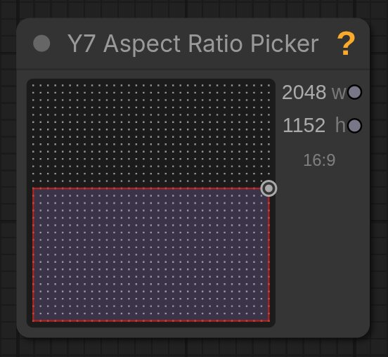
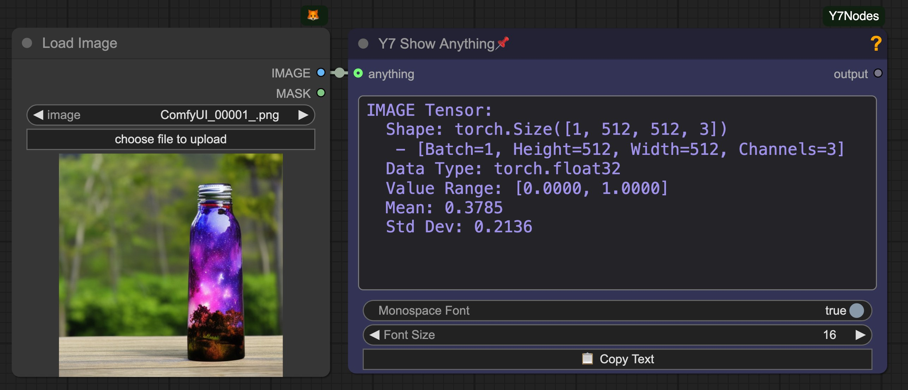
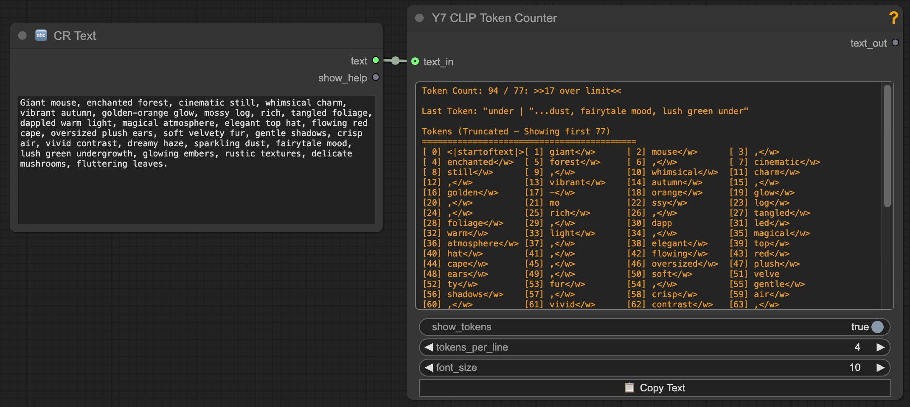
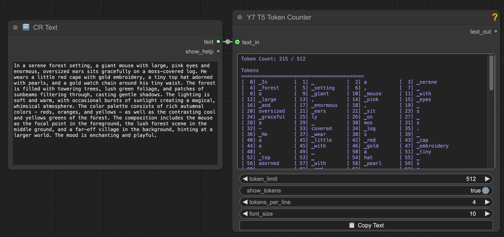
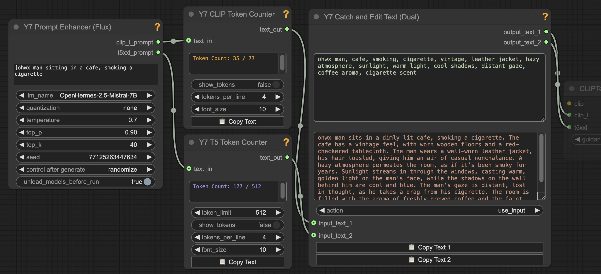
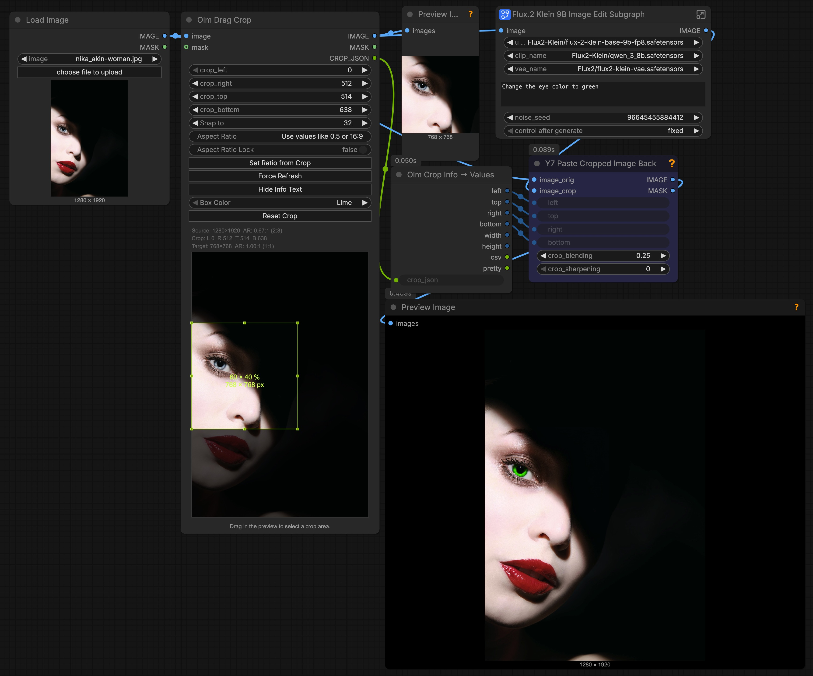

# ComfyUI-Y7Nodes

A collection of utility / quality-of-life nodes for ComfyUI - Probably only useful to me.  There's really nothing new here. Some nodes are modifications of of existing custom nodes with additional features that suit my particular needs.

## Installation (ComfyUI Manager)

 #### This is the better way to install: 
 - Open `ComfyUI Manager` 
   - → `Custom Nodes Manager` 
   - → Search for `Y7` or `Y7Nodes`. 
   - Install. 
   - Restart Restart ComfyUI

------

## Installation (Manual)

1. Clone this repository into your ComfyUI custom_nodes directory:
   ```bash
   cd /path/to/ComfyUI/custom_nodes
   git clone https://github.com/yushan777/ComfyUI-Y7Nodes
   
   ```

2. Install Dependencies
   ```bash
   # activate your venv (if you have one)
   # Linux/macOS
   source venv/bin/activate
   or 
   # Windows
   venv/Scripts/activate
   
   pip install -r requirements.txt   
   ```

3. Restart ComfyUI if it's already running.

------

## Nodes

### Y7 Aspect Ratio Picker

> Interactive 2D canvas for picking image width and height by dragging.
>
> 
> <details>
>   <summary>ℹ️ <i>See More Information</i></summary>
>
>   - Click or drag anywhere in the canvas to set width (X axis, left→right) and height (Y axis, bottom→top).
>   - A filled rectangle shows the selected proportions; the dot marks the current position.
>   - The simplified aspect ratio (e.g. 16:9, 4:3, 1:1) is displayed at the bottom of the canvas.
>   - Current width and height values are shown in the right panel. Double-click either value to type a number directly.
>   - Click the **Swap** button (below the height value) to swap width and height (portrait ↔ landscape).
>   - Snapping to step increments is on by default. Hold Shift while dragging to temporarily disable snapping.
>   - Node properties (right-click → Properties): `valueX`, `valueY`, `minX`, `maxX`, `minY`, `maxY`, `stepX`, `stepY`, `snap`, `dots`.
>   - The right panel shows width, height, simplified ratio (e.g. 16:9), and total megapixels (e.g. 1.0MP).
>   - Outputs `width` and `height` as INT.
>
> </details>

---

### Show Anything

> Takes input from any (most?) nodes and displays it in a readable format and provides a Copy Text button for easily copying the displayed content.
>
> 
> <details>
>   <summary>ℹ️ <i>See More Information</i></summary>
>   
>   - Based on other nodes that already work just fine. I just always wanted one with a `copy text` button for easy copying of long generated prompts (for editing or use elsewhere). It will primarily show `string, integer, float and boolean` values directly but will also (try to) display tensor data.
>
> </details>

---

### Y7 Image Stitcher

> Stitches 2–8 images side-by-side or top-to-bottom. The `image_count` widget controls how many image sockets are shown on the node.
>
> <details>
>   <summary>ℹ️ <i>See More Information</i></summary>
>
>   - Set `image_count` (2–8) to show exactly that many image input sockets. Sockets are added or removed live as you change the value.
>   - **Side-by-Side (Horizontal)**: all images are resized to match the first image's height, then concatenated left-to-right.
>   - **Top-and-Bottom (Vertical)**: all images are resized to match the first image's width, then concatenated top-to-bottom.
>   - Unconnected sockets within the count are skipped gracefully.
>   - Output is a single `IMAGE` tensor.
>
> </details>

---

### Y7 Image Compare

> Compares two images with a draggable slider for interactive side-by-side comparison directly on the node.
>
> <details>
>   <summary>ℹ️ <i>See More Information</i></summary>
>
>   - Connect `image_a` (required) and `image_b` (optional), then drag the slider to reveal `image_a` over `image_b`.
>   - Two blend modes: `normal` (slider wipe) and `difference` (highlights variations between the two images).
>   - The preview updates live as the slider is moved or the blend mode is changed, and persists across workflow-tab switches.
>   - The node auto-resizes to match the aspect ratio of the input images; slider position and blend mode are saved with the workflow.
>   - Right-click over the image for `Open Image` / `Save Image` options.
>   - Preview-only node with no outputs.
>   - Based on `Eses Image Compare` by Eses Nodes.
>
> </details>

---

### CLIP Token Counter

> Takes text (string) as input and, using the CLIP tokenizer, displays token count and more:
> 
> 
> <details>
>   <summary>ℹ️ <i>See More Information</i></summary>
>   
>   - Displays the number of tokens in the text  
>   - Whether the input exceeds the model's token limit  (77 - Including BOS and EOS)
>   - The final token within the range, along with surrounding context  
>   - All tokens within the limit, plus any overflow tokens beyond it
>   - Copy Text button: copies the contents displayed in the text widget
>   - Pass-though output for original text
>
> </details>

---

### T5 Token Counter

> Takes text (string) as input and, using the T5 XXL tokenizer, displays token count and more:
> 
> 
> <details>
>   <summary>ℹ️ <i>See More Information</i></summary>
>   
>   - Displays the number of tokens in the text  
>   - Whether the input exceeds the model's token limit  (256 or 512 - Including EOS)
>   - The final token within the range, along with surrounding context  
>   - All tokens within the limit, plus any overflow tokens beyond it
>   - Copy Text button: copies the contents displayed in the text widget
>   - Pass-though output for original text
>
> </details>

------

### Catch and Edit Text (Dual)
> Based on the original 
> A node that catches and shows text(s) generated from a previous node and enables editing the text for subsequent runs. Using the edited text also mutes the input node.  Modified from the original to take two text inputs to work with the Prompt Enhancer node and provide two text outputs.
> 
> 
> <details>
>   <summary>ℹ️ <i>See More Information</i></summary>
>
>   This node acts as a receiver and editor for text sent from two sources.
action widget:
- use_input: pass the input text as it without modification.
- use_edit_mute_input: pass the edited texts in the widgets and mute the source node of the input(s).

If you just need one text input then I recommend using [ImagineerNL's original node](https://github.com/ImagineerNL/ComfyUI-IMGNR-Utils).
> </details>

------

### Y7 Prompt Enhancer (Native)

> Takes any basic prompt and enhances it using a text encoder that ComfyUI has already loaded, via a `CLIP` input. Downloads nothing, loads nothing, and leaves all VRAM management to ComfyUI. Reasoning is separated from the prompt automatically.
>
> <details>
>   <summary>ℹ️ <i>See More Information</i></summary>
>
>   Where a typical prompt enhancer node owns its model (downloading it, loading it through HuggingFace transformers, and managing when to free it), this node does none of that. You load a text encoder with a standard `CLIPLoader` and connect it. ComfyUI handles loading, device placement and offloading exactly as it does for any other model in your workflow.
>
>   **Supported models**
>
>   Any text encoder with a native generation path:
>
>   | Model | Variants |
>   | --- | --- |
>   | Gemma 4 | E2B, E4B, 31B, 12B unified |
>   | Gemma 3 | 12B (including the LTX-2 text encoder built on it) |
>   | Qwen3 | 0.6B, 2B, 4B, 8B |
>   | Qwen3.5 | 0.8B, 2B, 4B, 9B, 27B |
>   | Qwen3-VL | 4B, 8B |
>
>   **Not supported** — T5 (all sizes), UMT5, CLIP-L, CLIP-G, Gemma 2, LLaMA-3.1. These have no text generation path; the node detects this and tells you, rather than failing with an obscure error deep inside the encoder.
>
>   **Model format**
>
>   Safetensors only, placed in `models/text_encoders/`. GGUF will **not** work — ComfyUI core has no GGUF loader (`.gguf` is not even a recognised model extension), and for Gemma 4 the tokenizer is embedded inside the safetensors file, so a converted GGUF would be missing it.
>
>   For Gemma 4 the `CLIPLoader` `type` dropdown is ignored — the model is detected from the weights themselves, so any value in that dropdown works.
>
>   Gemma 4 weights: https://huggingface.co/Comfy-Org/gemma-4/tree/main/text_encoders
>
>   ```
>   ComfyUI
>   └── models
>       └── text_encoders
>           └── gemma4_e4b_it_bf16.safetensors
>   ```
>
>   **Inputs**
>
>   - `clip`: A generation-capable text encoder from `CLIPLoader`
>   - `text`: Your basic prompt. Accepts a connection from any string node.
>   - `instruction`: The instruction placed before your text. Edit to change the enhancement style.
>   - `max_length`: Maximum **new** tokens to generate (64–32768, default 2048). Not the context window. Reasoning is spent from the same budget, and the KV cache reserves roughly 84KB of VRAM per token up front.
>   - `temperature`: 0.0–2.0, default 1.0 (Google's recommended value for Gemma). 0 switches to greedy decoding.
>   - `top_k`: 0–1000, default 64 (Google's recommended value). 0 disables.
>   - `top_p`: 0.0–1.0, default 0.95 (Google's recommended value). 1.0 disables.
>   - `seed`: Change it to re-roll — identical inputs return a cached result.
>   - `thinking`: Let the model reason before answering.
>
>   **Outputs**
>
>   - `thinking_output`: The model's reasoning, if it produced any
>   - `enhanced_prompt`: The enhanced prompt, with all reasoning removed
>
>   **On reasoning**
>
>   Gemma 4 writes its reasoning into a thought channel, and ComfyUI's decoder deliberately preserves that text instead of discarding it. Turning `thinking` off only *primes* the model to skip reasoning — Gemma 4 often reasons anyway, which is why ComfyUI's own **Generate Text** node can hand back a wall of planning notes with the actual prompt buried at the end.
>
>   This node always separates the two, including the awkward case where the model reasons straight past the primed channel and closes it with an unmatched tag. If `enhanced_prompt` comes back empty, the model spent the entire `max_length` budget reasoning — raise it, or lower `temperature`.
>
> </details>

------

### LM Studio Nodes — Prerequisites

> The **LM Studio (Text)**, **LM Studio (Vision)**, and **Select LMS Model** nodes all require a running [LM Studio](https://lmstudio.ai/) server. LM Studio is a free desktop application for running LLMs locally.
>
> <details>
>   <summary>ℹ️ <i>LM Studio Server Setup</i></summary>
>   
>   **Local Setup (same machine as ComfyUI):**
>   
>   1. Download and install [LM Studio](https://lmstudio.ai/)
>   2. Download a model through the LM Studio interface (for vision nodes, ensure you pick a VL model, e.g. Qwen2.5-VL, Gemma3, etc.)
>   3. Load the model in LM Studio
>   4. Start the local server: go to the **Developer** tab (or **Local Server** in older versions) and click **Start Server**
>   5. By default, the server runs on `localhost:1234` — this matches the default `ip` and `port` values in the nodes
>   
>   **Network Setup (LM Studio on a different machine):**
>   
>   If LM Studio is running on another machine on your network:
>   
>   1. In LM Studio's server settings, enable **Serve on Local Network** (this binds the server to `0.0.0.0` instead of `127.0.0.1`)
>   2. Note the IP address of the machine running LM Studio (e.g., `192.168.1.100`)
>   3. In the ComfyUI node, set the `ip` field to that machine's IP address and ensure the `port` matches (default: `1234`)
>   4. Make sure there are no firewall rules blocking the port between the two machines
>   
>   **Model Identifier:**
>   
>   The `model_identifier` should match the model name as it appears in LM Studio. You can use the **Select LMS Model** node to pick from a predefined list stored in `comfyui-y7nodes/lms_config/models.txt` (one model name per line).
>   
>   **Python Package:**
>   
>   These nodes require the `lmstudio` Python SDK: `pip install lmstudio`
>
> </details>

---

### Y7 LM Studio (Text)

> Send text prompts to a local LM Studio server for text generation and prompt enhancement using any LLM loaded in LM Studio. Supports speculative decoding via a draft model.
>
> <details>
>   <summary>ℹ️ <i>See More Information</i></summary>
>   
>   Connects to an LM Studio server and sends a text prompt along with a system message to guide the model's behavior. The default system message is optimized for AI image prompt enhancement, but can be customized for any text generation task.
>   
>   **Key Features:**
>   
>   - **System Message**: Customizable system prompt that guides the LLM's behavior (default: image prompt enhancement)
>   - **Draft Model**: Optional speculative decoding support for faster generation
>   - **Reasoning Extraction**: Automatically separates thinking/reasoning blocks from the response
>   - **Memory Management**: Options to unload the LLM after generation and/or free ComfyUI VRAM beforehand
>   - **Fallback Handling**: Automatically retries with an alternative chat template if the first attempt fails
>   
>   **Inputs:**
>   
>   - `prompt`: The text prompt to send to the LLM (connected from another node)
>   - `model_identifier`: The model name/identifier loaded in LM Studio (connect a Select LMS Model node or type manually)
>   - `draft_model`: Optional speculative decoding draft model name (leave empty to disable)
>   - `system_message`: System prompt that guides the LLM's behavior
>   - `reasoning_tag`: Tag name used to extract reasoning blocks (e.g., `think` for `<think>...</think>`)
>   - `ip` / `port`: LM Studio server address (default: localhost:1234)
>   - `temperature`: Controls randomness (0.01–1.0, default 0.7)
>   - `max_tokens`: Maximum tokens to generate (-1 for unlimited)
>   - `unload_llm`: Unload the LLM from LM Studio after generation
>   - `unload_comfy_models`: Free VRAM by unloading ComfyUI models before running the LLM
>   
>   **Outputs:**
>   
>   - `Extended Prompt`: The generated text with reasoning blocks removed
>   - `Reasoning`: The extracted reasoning content (if present)
>   
>   **Requirements:**
>   
>   - LM Studio running locally (or on a network-accessible machine)
>
> </details>

---

### Y7 LM Studio (Vision)

> Send an image to a vision-capable LLM (VL model) in LM Studio for analysis and description. The instruction is provided via the system message — no separate text prompt input.
>
> <details>
>   <summary>ℹ️ <i>See More Information</i></summary>
>   
>   Connects to an LM Studio server and sends an image along with an instruction to a vision-language (VL) model. The system message acts as the sole instruction for how the model should interpret the image. The model must be vision-enabled or an error will be raised.
>   
>   **Key Features:**
>   
>   - **Vision-First Design**: Image is a required input — purpose-built for VL models
>   - **Instruction via System Message**: The system message is sent alongside the image as the user instruction (default: detailed image description)
>   - **Model Validation**: Checks that the loaded model supports vision before proceeding
>   - **Reasoning Extraction**: Automatically separates thinking/reasoning blocks from the response
>   - **Memory Management**: Options to unload the LLM after generation and/or free ComfyUI VRAM beforehand
>   
>   **Inputs:**
>   
>   - `image`: The image to analyze (required)
>   - `model_identifier`: The VL model name/identifier loaded in LM Studio (connect a Select LMS Model node or type manually)
>   - `system_message`: The instruction sent alongside the image (default: describe the image in detail)
>   - `reasoning_tag`: Tag name used to extract reasoning blocks (e.g., `think` for `<think>...</think>`)
>   - `ip` / `port`: LM Studio server address (default: localhost:1234)
>   - `temperature`: Controls randomness (0.01–1.0, default 0.7)
>   - `max_tokens`: Maximum tokens to generate (-1 for unlimited)
>   - `unload_llm`: Unload the LLM from LM Studio after generation
>   - `unload_comfy_models`: Free VRAM by unloading ComfyUI models before running the LLM
>   
>   **Outputs:**
>   
>   - `Response`: The model's analysis/description with reasoning blocks removed
>   - `Reasoning`: The extracted reasoning content (if present)
>   
>   **Requirements:**
>   
>   - LM Studio running locally (or on a network-accessible machine)
>   - A vision-capable model loaded in LM Studio (non-vision models will raise an error)`
>
> </details>

---

### Y7 Select LMS Model

> Select an LM Studio model from a predefined list stored in a text file. Outputs the model identifier string to connect to the LM Studio Text or Vision nodes.
>
> <details>
>   <summary>ℹ️ <i>See More Information</i></summary>
>   
>   Provides a dropdown of model identifiers loaded from `comfyui-y7nodes/lms_config/models.txt`. Add your favorite model names (one per line) to this file.
>   
>   **Output:**
>   
>   - `model_id`: The selected model identifier string
>
> </details>

---

### Y7 Image Batch Path

> Load a batch of images from a directory and output them as a list of image tensors with matching file paths. Designed to pair with Caption Saver and a VLM node for batch captioning workflows.
>
> <details>
>   <summary>ℹ️ <i>See More Information</i></summary>
>
>   Supports jpg, jpeg, png, and webp. Images are EXIF-transposed and converted to RGB float32 tensors.
>
>   Connect `IMAGE` to a VLM node and `IMAGE_PATH` to Caption Saver. The path list tells Caption Saver exactly where to write each `.txt` file.
>
>   **Inputs:**
>
>   - `image_dir`: Path to the directory containing images
>   - `batch_size`: Number of images to load (0 = all)
>   - `start_from`: 1-based index of the first image to load — useful for resuming part-way through a directory
>   - `sort_method`: Load order — `sequential` (alphabetical), `reverse`, or `random`
>
>   **Outputs** (both are lists):
>
>   - `IMAGE`: List of image tensors, one per file
>   - `IMAGE_PATH`: List of full file paths matching each image tensor
>
>   Note: When `sort_method` is `random`, the node re-evaluates on every run.
>
> </details>

---

### Y7 Caption Saver

> Save a caption string as a `.txt` file next to the source image, using the same filename stem (e.g. `cat.jpg` → `cat.txt`).
>
> <details>
>   <summary>ℹ️ <i>See More Information</i></summary>
>
>   Designed to pair with **Image Batch Path** and a VLM node: connect `IMAGE_PATH` from Image Batch Path and the caption `STRING` from the VLM node.
>
>   Compatible with any node that outputs a STRING. Examples: Florence2, MiniCPM, LLaVA, Qwen-VL, etc.
>
>   **Inputs:**
>
>   - `string`: The caption text to write (must be connected)
>   - `image_path`: Full path to the source image (must be connected — e.g. from Image Batch Path)
>   - `overwrite`: If true, overwrites any existing `.txt` file. If false, appends a counter to avoid overwriting (e.g. `cat_01.txt`, `cat_02.txt`)
>
>   This node has no outputs — it is a terminal/output node.
>
> </details>

---

### Y7 Image Size Presets
> Select predefined image size/aspect ratios from a named preset set. Provides width and height outputs.
>
> <details>
>   <summary>ℹ️ <i>See More Information</i></summary>
>
>   - Provides outputs for `width` and `height` (INT).
>   - The `preset` widget selects the active dimension set: `default`, `flux.2`, `qwen-image`, or `custom*`.
>   - The `dimension` dropdown updates dynamically to show only the dimensions for the selected preset.
>   - Select `Custom` from the dimension dropdown to use manually entered `custom_w` / `custom_h` values.
>   - The `custom*` preset loads from `custom_dimensions.json` in the `nodes` directory; falls back to `default` if the file is missing or invalid. See `custom_dimensions_example.json` for the expected format.
> </details>

---

### Y7 Resolution Selector

> Calculate width and height from an aspect ratio and a megapixel target, rounded to the nearest multiple.
>
> <details>
>   <summary>ℹ️ <i>See More Information</i></summary>
>
>   A clone of ComfyUI's built-in V3 `ResolutionSelector` node, with a finer-grained `megapixels` step (0.01 instead of 0.1) and the resolution displayed directly on the node after execution.
>
>   **Inputs:**
>
>   - `aspect_ratio`: The target aspect ratio (e.g. `1:1 (Square)`, `16:9 (Widescreen)`)
>   - `megapixels`: Target total megapixels (default: 1.0, range: 0.1–16.0)
>   - `multiple`: Rounds the result to the nearest multiple of this value (default: 8)
>
>   **Outputs:**
>
>   - `width`: Calculated width in pixels (INT)
>   - `height`: Calculated height in pixels (INT)
>
> </details>

---

### Y7 Scale Image By

> Scales an image by a multiplier while preserving aspect ratio.
>
> <details>
>   <summary>ℹ️ <i>See More Information</i></summary>
>
>   Multiplies both width and height by `scale_by`, then resamples using the chosen method. The output resolution is displayed directly on the node after execution.
>
>   **Inputs:**
>
>   - `image`: The input image to scale
>   - `upscale_method`: Resampling algorithm — `nearest-exact`, `bilinear`, `area`, `bicubic`, or `lanczos`
>   - `scale_by`: Multiplier applied to both dimensions (default: 1.0, range: 0.01–8.0)
>   - `resolution_steps`: Snap output dimensions to the nearest multiple of this value (default: 8). Common values: 8, 16, 64
>
>   **Outputs:**
>
>   - `image`: The scaled image
>   - `width`: Output width in pixels (INT)
>   - `height`: Output height in pixels (INT)
>
> </details>

---

### Y7 Scale Image to Total Pixels

> Scales an image to a target total pixel count (in megapixels) while preserving aspect ratio.
>
> <details>
>   <summary>ℹ️ <i>See More Information</i></summary>
>
>   Computes a uniform scale factor so that `width × height` equals the target megapixel count, then resamples using the chosen method. The output resolution is displayed directly on the node after execution.
>
>   **Inputs:**
>
>   - `image`: The input image to scale
>   - `upscale_method`: Resampling algorithm — `nearest-exact`, `bilinear`, `area`, `bicubic`, or `lanczos`
>   - `megapixels`: Target total pixel count in megapixels (default: 1.0, range: 0.01–16.0)
>   - `resolution_steps`: Snap output dimensions to the nearest multiple of this value (default: 8). Common values: 8, 16, 64
>
>   **Outputs:**
>
>   - `image`: The scaled image
>   - `width`: Output width in pixels (INT)
>   - `height`: Output height in pixels (INT)
>
> </details>

---

### Y7 Crop to Resolution
> Automatically crops images to ensure dimensions are divisible by a specified value (e.g., 8 or 16), with visual preview of crop areas and independent horizontal/vertical control.
>
> <details>
>   <summary>ℹ️ <i>See More Information</i></summary>
>   
>   Many AI models require image dimensions to be divisible by specific values (typically 8 or 16) for proper processing. This node automatically checks image dimensions and crops them to meet these requirements while giving you precise control over where the crop occurs.
>   
>   **Key Features:**
>   
>   - **Visual Preview**: Shows original image with semi-transparent red overlay indicating areas that will be cropped
>   - **Independent Control**: Separate horizontal and vertical crop position settings
>   - **Smart Logic**: Only crops dimensions that need adjustment, ignoring dimensions that are already aligned
>   - **Flexible Positioning**: Choose `center`, `left`, `right`, `top`, `bottom`, or `none` for each axis
>   - **Informative Output**: Provides detailed status messages about dimensions and any cropping performed
>   - **On-Node Display**: Shows the cropped dimensions (e.g., '1024 x 768') directly on the node after execution
>   
>   **Inputs:**
>   
>   - `multiple`: The value dimensions must be a multiple of (default: 16). Common values are 8 or 16 for most AI models
>   - `horizontal_crop`: Where to keep content when width needs adjustment - `center`, `left`, `right`, or `none`
>   - `vertical_crop`: Where to keep content when height needs adjustment - `center`, `top`, `bottom`, or `none`
>   
>   **Outputs:**
>   
>   - `crop_preview`: Original image with red overlay showing what will be cropped (useful for previewing before committing)
>   - `image`: The cropped result (or original if no cropping needed)
>   - `info`: Status message with dimension details and cropping information
>   
>   **Behavior Notes:**
>   
>   - Crops to the nearest multiple down (e.g., 721 → 720 with multiple=16)
>   - Setting a crop position to `none` disables cropping for that dimension
>   - When using `center` with odd-numbered pixel differences, integer division rounds down (e.g., width=721 removes 1px from right only)
>   - This slight bias is standard in image processing and is minimal (max 1 pixel difference)
>   
>   **Use Cases:**
>   
>   - Preparing images for models that require specific dimension constraints
>   - Cropping images from one dimension while keeping the other intact
>   - Quick visual verification of crop areas before applying
>
> </details>

---

### Y7 Paste Cropped Image Back

> 
>
> Paste a cropped image back onto a base image post-editing at a region defined by edge-relative coordinates. Varient of the WAS equivalent, except `right` and `bottom` are offsets measured inward from the right and bottom edges.
>
> <details>
>   <summary>ℹ️ <i>See More Information</i></summary>
>
>   Sometimes you may want to change or refine a specific area of an image without affecting the rest too much — for example, fixing a face, hand, or background detail after generation. A typical workflow is to crop the region, run it through img2img or inpainting, then paste the result back using this node.
>
>   Works well with the **OLM Drag Crop** custom node, which lets you visually drag-select a crop region and outputs the crop coordinates directly — those coordinates can be wired into this node's `top`, `left`, `right`, and `bottom` inputs.
>
>   The paste region is computed as:
>   - `x1 = left`
>   - `y1 = top`
>   - `x2 = image_width - right`
>   - `y2 = image_height - bottom`
>
>   This makes it easy to target edge-relative regions without knowing the image dimensions in advance — e.g., set `right=256, bottom=256` to always paste into the bottom-right 256-wide strip of any image.
>
>   The `image_crop` is always resized to exactly fit the paste region. If it was upscaled for editing (e.g. sent through img2img at a higher resolution), it will be scaled back down during pasting. There is no aspect-ratio preservation — if the aspect ratio of the crop image differs from the paste region, it will be stretched to fit and appear distorted.
>
>   **Inputs:**
>
>   - `image_orig`: Base image to paste onto
>   - `image_crop`: Image to paste into the defined region (resized to fit)
>   - `left` / `top`: Pixel offsets from the left and top edges
>   - `right` / `bottom`: Pixel offsets inward from the right and bottom edges
>   - `crop_blending`: Feathering/blending amount at paste edges (0.0–1.0)
>   - `crop_sharpening`: Number of sharpening passes applied before pasting (0–3)
>
>   **Outputs:**
>
>   - `IMAGE`: Base image with crop pasted in
>   - `MASK`: The blended mask used for the paste operation
>
> </details>

---

### Sampler Select (Name)

> Select a sampler by name and output it as a linkable string — works around ComfyUI's built-in KSampler nodes not exposing sampler name as a connectable input.

---

### Y7 Load Image

> The native ComfyUI Load Image node only lists files directly in the `input` folder. This node is identical except it walks the full `input` directory tree, so images organised into subdirectories appear in the dropdown.
>
> Outputs `image` (IMAGE) and `mask` (MASK), same as the built-in node.

---

## Example Workflows

Example workflows can be found in the `workflows` directory. 

## License

This project is licensed under the MIT License - see the [LICENSE](LICENSE) file for details.

## Credits

- ShowAnything node is based on "Show Any" from yolain's ComfyUI-Easy-Use custom nodes and "Show Any To JSON" from crystian's ComfyUI-Crystools custom nodes, with additional formatting controls and a Copy Text button.
- Help popup system is based on the implementation from Kosinkadink's ComfyUI-VideoHelperSuite.
