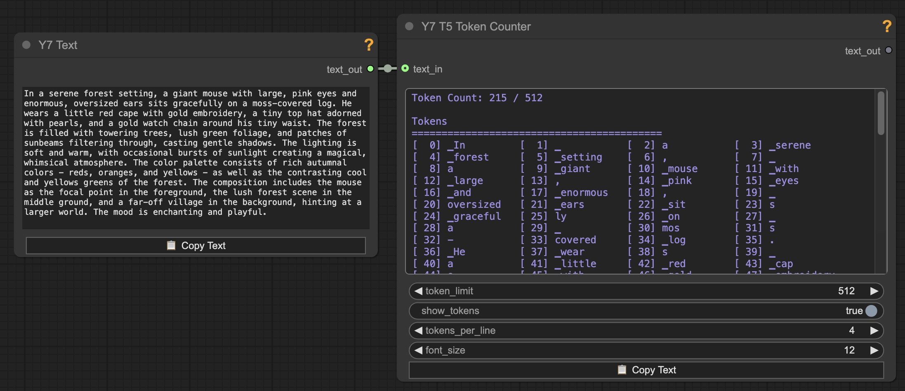

# ComfyUI-Y7Nodes

A collection of utility / quality-of-life nodes for ComfyUI - Probably only useful to me.  There's really nothing new here. Some nodes are modifications of of existing custom nodes with additional features that suit my particular needs.

## Installation (ComfyUI Manager)

 #### This is the better way to install: 
 - Open `ComfyUI Manager` 
   - → `Custom Nodes Manager` 
   - → Search for `Y7` or `Y7Nodes`. 
   - Install. 
   - Restart Restart ComfyUI

------

## Installation (Manual)

1. Clone this repository into your ComfyUI custom_nodes directory:
   ```bash
   cd /path/to/ComfyUI/custom_nodes
   git clone https://github.com/yushan777/ComfyUI-Y7Nodes
   
   ```

2. Install Dependencies
   ```bash
   # activate your venv (if you have one)
   # Linux/macOS
   source venv/bin/activate
   or 
   # Windows
   venv/Scripts/activate
   
   pip install -r requirements.txt   
   ```

3. Restart ComfyUI if it's already running.

------

## Nodes

### Show Anything

> Takes input from any (most?) nodes and displays it in a readable format and provides a Copy Text button for easily copying the displayed content.
>
> 
> <details>
>   <summary>ℹ️ <i>See More Information</i></summary>
>   
>   - Based on other nodes that already work just fine. I just always wanted one with a `copy text` button for easy copying of long generated prompts (for editing or use elsewhere). It will primarily show `string, integer, float and boolean` values directly but will also (try to) display tensor data.
>
> </details>

---
### Image Row
> Takes up to 4 images and concats them together horizontally in a row with captions:
> 
> 
> <details>
>   <summary>ℹ️ <i>See More Information</i></summary>
>
>   - Captions list will map too whatever images has been inputed
>   - Preview mode by default, switch to save mode.
> </details>

---

### CLIP Token Counter

> Takes text (string) as input and, using the CLIP tokenizer, displays token count and more:
> 
> 
> <details>
>   <summary>ℹ️ <i>See More Information</i></summary>
>   
>   - Displays the number of tokens in the text  
>   - Whether the input exceeds the model's token limit  (77 - Including BOS and EOS)
>   - The final token within the range, along with surrounding context  
>   - All tokens within the limit, plus any overflow tokens beyond it
>   - Copy Text button: copies the contents displayed in the text widget
>   - Pass-though output for original text
>
> </details>

---

### T5 Token Counter

> Takes text (string) as input and, using the T5 XXL tokenizer, displays token count and more:
> 
> 
> <details>
>   <summary>ℹ️ <i>See More Information</i></summary>
>   
>   - Displays the number of tokens in the text  
>   - Whether the input exceeds the model's token limit  (256 or 512 - Including EOS)
>   - The final token within the range, along with surrounding context  
>   - All tokens within the limit, plus any overflow tokens beyond it
>   - Copy Text button: copies the contents displayed in the text widget
>   - Pass-though output for original text
>
> </details>

------

### Catch and Edit Text (Dual)
> Based on the original 
> A node that catches and shows text(s) generated from a previous node and enables editing the text for subsequent runs. Using the edited text also mutes the input node.  Modified from the original to take two text inputs to work with the Prompt Enhancer (shown below) and provide two text outputs.
> 
> 
> <details>
>   <summary>ℹ️ <i>See More Information</i></summary>
>
>   See screenshot for Prompt Enhancer below. 
>
>   This node acts as a receiver and editor for text sent from two sources.
action widget:
- use_input: pass the input text as it without modification.
- use_edit_mute_input: pass the edited texts in the widgets and mute the source node of the input(s).

If you just need one text input then I recommend using [ImagineerNL's original node](https://github.com/ImagineerNL/ComfyUI-IMGNR-Utils).
> </details>

------

### Y7 Prompt Enhancer (Flux)

> Takes any basic prompt and enhances it and produces T5 and CLIP friendly variants of the enhanced prompt. token / trigger words can be used in sq. brackets
> Example: [ohwx man], [agg woman], [sks dog]
>
> 
> <details>
>   <summary>ℹ️ <i>See More Information</i></summary>
>   
>   
>   
>   Flux.1 uses two encoders: CLIP and T5 XXL. CLIP processes only the first 77 tokens (including <bos>/<eos>), and anything beyond that depends on the implementation. In ComfyUI, long prompts are split into 77-token chunks for CLIP, which are then batched and concatenated. On the other hand, T5, supports up to 512 tokens (or 256 in the "schnell" version) and works well with natural, descriptive language.
>   
>   Most users simply feed the same (T5) prompt into both encoders, as it's the most straightforward approach. However, because the first 77 tokens are shared by both encoders—and the rest are exclusive to T5—how you structure your prompt can make a big difference.
>   
>   Front-loading long prose too early can reduce CLIP's effectiveness, while cramming too many keywords up front may limit T5's ability to build nuance throughout the rest of the prompt.
>   
>   For (possibly) better results, a hybrid approach of starting with high-impact keywords to guide CLIP, then follow with flowing, descriptive language tailored for T5. This approach plays to the strengths of both encoders (again, possibly).
>   
>   **Token/Trigger words** are handled by enclosing them inside square brackets `[ohwx man]`, but occasionally it might not work.
>
>  There can be quirks in some of the responses generated, but it will get you most of the way in producing prompts in both formats very quickly and you can always edit them afterwards (in your own editor). 
>   
>   Four LLM models are available, offering a balance of knowledge, instruction-following, and minimal censorship.
> 
>   If you're using a GPU with limited VRAM, consider switching to 8-bit or 4-bit quantization to reduce memory usage (with some trade-offs in quality).
**Note: This requires BitsandBytes** which is primarily Linux-focused. Support for Windows and macOS can be tricky — and there might be workarounds, but they’re beyond the scope of this note.
If you're running ComfyUI inside WSL (Windows Subsystem for Linux), you should be fine
>
>   Additionally, you can choose to unload all models before each run — helpful for workflows involving other large models that remain cached. Alternatively, you can always use [SeanScripts's Unload Model custom nodes](https://github.com/SeanScripts/ComfyUI-Unload-Model) which provide a convenient way to handle this dynamically.
>
>   The node will attempt to download the selected model (approx 14.5GB) if it can't be found.  
>
>   If you wish to download the model(s) manually, links and paths shown below:
>   https://huggingface.co/teknium/OpenHermes-2.5-Mistral-7B 
>   
>   ```
>   ComfyUI
>   └── models
>       └── LLM
>           └── OpenHermes-2.5-Mistral-7B
>           |   ├── added_tokens.json
>           |   ├── config.json
>           |   ├── generation_config.json
>           |   ├── model-00001-of-00002.safetensors
>           |   ├── model-00002-of-00002.safetensors
>           |   ├── model.safetensors.index.json
>           |   ├── special_tokens_map.json
>           |   ├── tokenizer.model
>           |   ├── tokenizer_config.json
>           |   ├── transformers_inference.py>           
>   ```
>   
>   For https://huggingface.co/teknium/Hermes-Trismegistus-Mistral-7B (approx. 14.5GB)
>   
>   ```
>   ComfyUI
>   └── models
>       └── LLM        
>           └── Hermes-Trismegistus-Mistral-7B        
>           |   ├── added_tokens.json
>           |   ├── config.json
>           |   ├── generation_config.json
>           |   ├── pytorch_model-00001-of-00002.bin
>           |   ├── pytorch_model-00002-of-00002.bin
>           |   ├── pytorch_model.bin.index.json
>           |   ├── special_tokens_map.json
>           |   ├── tokenizer.model
>           |   ├── tokenizer_config.json
>   ```
>
>   For https://huggingface.co/cognitivecomputations/Dolphin3.0-Llama3.1-8B (approx. 16GB)
>   ```
>   ComfyUI
>   └── models
>       └── LLM        
>           └── Dolphin3.0-Llama3.1-8B        
>           |   ├── config.json
>           |   ├── generation_config.json
>           |   ├── model-00001-of-00004.safetensors
>           |   ├── model-00002-of-00004.safetensors
>           |   ├── model-00003-of-00004.safetensors
>           |   ├── model-00004-of-00004.safetensors
>           |   ├── model.safetensors.index.json
>           |   ├── special_tokens_map.json
>           |   ├── tokenizer_config.json
>           |   ├── tokenizer.json
>           |   ├── trainer_state.json
>   ```

>   For https://huggingface.co/Qwen/Qwen2.5-7B-Instruct (approx. 15.2GB)
>   ```
>   ComfyUI
>   └── models
>       └── LLM        
>           └── Qwen2.5-7B-Instruct      
>           |   ├── config.json
>           |   ├── generation_config.json
>           |   ├── merges.txt
>           |   ├── model-00001-of-00004.safetensors
>           |   ├── model-00002-of-00004.safetensors
>           |   ├── model-00003-of-00004.safetensors
>           |   ├── model-00004-of-00004.safetensors
>           |   ├── model.safetensors.index.json
>           |   ├── tokenizer.json
>           |   ├── tokenizer_config (1).json
>           |   ├── tokenizer_config.json
>           |   ├── vocab.json
>   ```


> </details>

------

### Y7 Grid 2 Batch

> Takes a grid of images (like those generated in XY-plots) and processes it into a batch of individual images.
> <details>
>   <summary>ℹ️ <i>See More Information</i></summary>
>   
>   Define the number of rows, columns, the size of the individual images in the grid, any offsets (to account for headers). Output is a batch of images that can be processed further in your workflow
>   
>   
>   
>   **Parameters:**
>   
>   - `rows`: Number of rows in the grid
>   - `columns`: Number of columns in the grid
>   - `width`: Width of each individual image in the grid (in pixels)
>   - `height`: Height of each individual image in the grid (in pixels)
>   - `x_header`: If grid has an X header, specify its width in pixels. Set to 0 if there is no header.
>   - `y_header`: If grid has a Y header, specify its height in pixels. Set to 0 if there is no header.
> </details>

---

### Y7 Image Size Presets
> Select predefined image size/aspect ratios loaded from a custom json file. Provides width and height outputs.
>
> <details>
>   <summary>ℹ️ <i>See More Information</i></summary>
>   - Provides outputs for `width` and `height` (INT).
>   - Looks for and loads presets from `custom_dimensions.json` located in the `nodes` directory. You can edit this file to add your own presets.
> </details>


## Example Workflows

Example workflows can be found in the `workflows` directory. 

## License

This project is licensed under the MIT License - see the [LICENSE](LICENSE) file for details.

## Credits

- ShowAnything node is based on "Show Any" from yolain's ComfyUI-Easy-Use custom nodes and "Show Any To JSON" from crystian's ComfyUI-Crystools custom nodes, with additional formatting controls and a Copy Text button.
- Help popup system is based on the implementation from Kosinkadink's ComfyUI-VideoHelperSuite.
